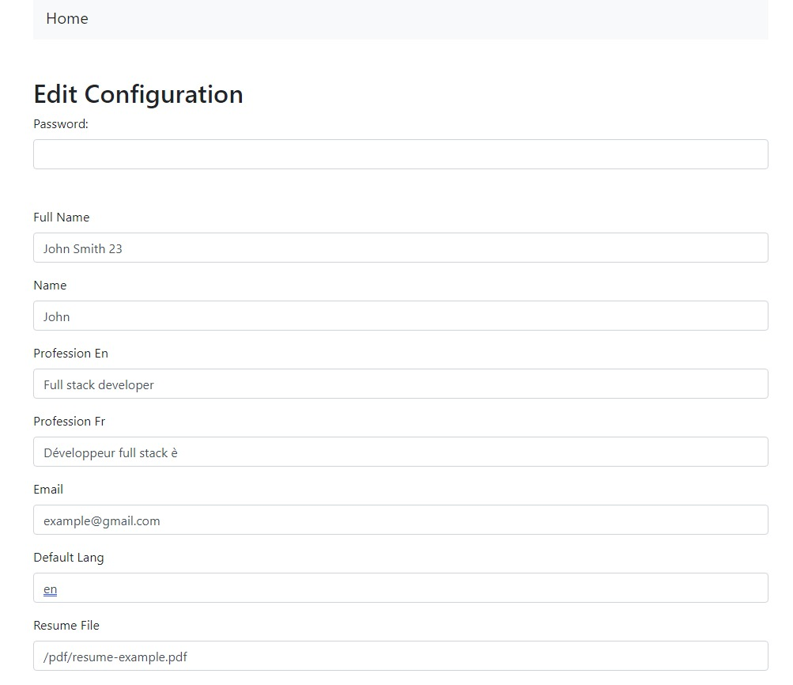

# onepagersphp

This repository contains lots of onepagers websites in PHP.

<https://github.com/JackEd0/onepagersphp>

## Similar repositories

Create a single folder to store multiple sinple site so that it won't be necesary to create a new hosting folder for new sites.
<https://bitbucket.org/JacK00jack/simple-multisite/src/master/>

A workspace to hold simple php/html themes
<https://bitbucket.org/JacK00jack/studio-php/src/master/>

## Sites

- Admin v1
Simple admin page that flatten then deflatten the config file.
The password is stored in a `.env` file and asked on the same page.
Uses `bootstrap.min.css` and a composer package.

### Installation

- `composer install`
- Copy `config.example.json` to `site.json`
- Copy `env.example` to `.env`
